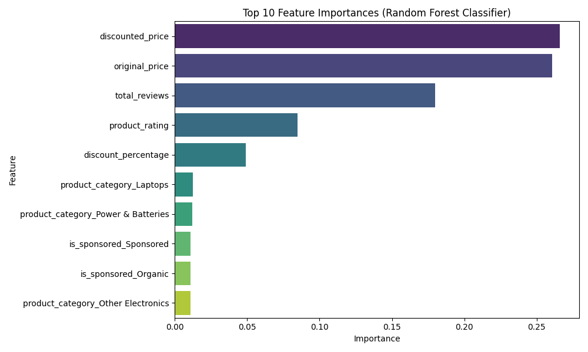
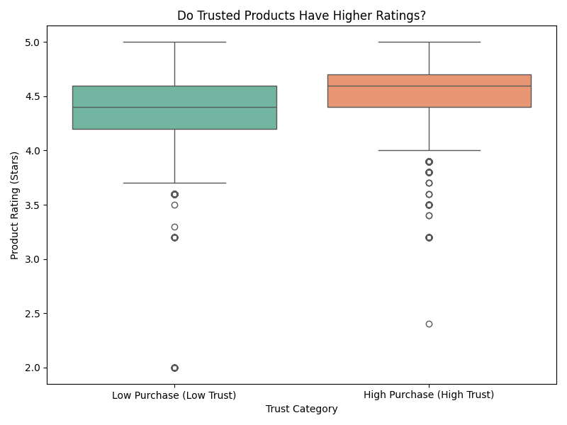
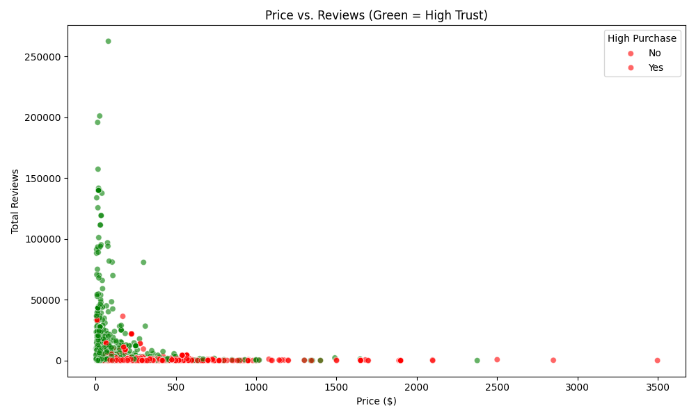
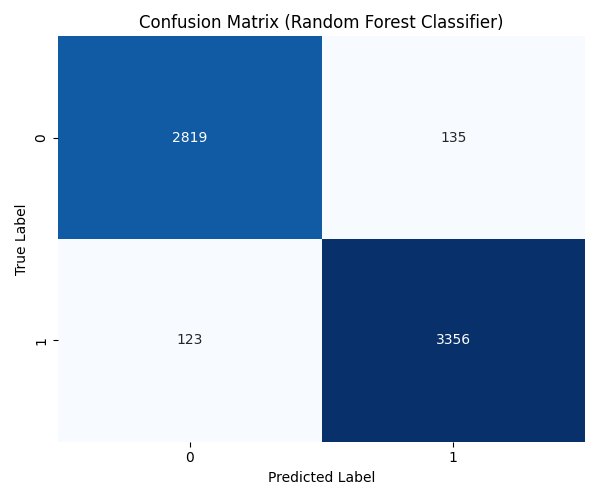

# Trust-Based Product Analysis Model

This project analyzes Amazon product data to identify key factors that drive customer trust and purchase decisions. Using machine learning, we predict whether a product will have a "high purchase" volume based on trust signals like ratings, reviews, badges, and pricing.

## Problem Statement

In the vast e-commerce landscape, customers rely on specific signals to decide if a product is trustworthy. Understanding which signals (e.g., "Best Seller" badge, discount percentage, review count) actually correlate with high sales is crucial for sellers and platforms. This project aims to quantify these relationships and build a predictive model to score product "trustworthiness."

## Key Results

We trained and compared two models: **Gradient Boosting Classifier** and **Random Forest Classifier**.

1.  **Best Model**: The **Random Forest Classifier** achieved the highest accuracy of **96.05%**.
2.  **Key Drivers**: Analysis revealed that **Total Reviews**, **Product Rating**, and **Discounted Price** are among the most influential factors for predicting high purchase volume.
3.  **Trust Score**: We developed a "Trust Score" calculator that outputs the probability of a product being a high-performer.

### Visualizations

#### 1. Feature Importance
**What it shows:** Which factors most strongly influence the model's decision.
**How to read it:** Longer bars mean that feature is more important. For example, if "Total Reviews" is at the top, it means the number of reviews is the biggest driver of trust.


#### 2. Rating vs. Trust (Box Plot)
**What it shows:** The distribution of star ratings for Low Trust (0) vs. High Trust (1) products.
**How to read it:** Look at the box (the middle 50% of data) and the line inside it (the median). If the orange box (High Trust) is higher than the green one, it means trusted products generally have higher ratings.


#### 3. Price vs. Reviews (Scatter Plot)
**What it shows:** How price and review count relate to trust.
**How to read it:**
*   **Green Dots**: High Trust products (High Purchase Volume).
*   **Red Dots**: Low Trust products.
*   Notice where the green dots cluster. Are they mostly at lower prices with high reviews? This tells you the "sweet spot" for customer trust.


#### 4. Model Performance (Confusion Matrix)
**What it shows:** How often the model is correct.
**How to read it:** The diagonal boxes (top-left and bottom-right) show correct predictions. The off-diagonal boxes show errors. Darker blues on the diagonal are good!


### Key Statistics (High vs. Low Trust)

| Metric | Low Trust (Avg) | High Trust (Avg) | Insight |
| :--- | :--- | :--- | :--- |
| **Product Rating** | 4.34 stars | 4.50 stars | Trusted products are rated higher. |
| **Total Reviews** | Lower | Higher | Social proof is critical. |
| **Discount %** | 6.06% | 9.60% | Better deals drive more trust/sales. |


## Methodologies

1.  **Data Preprocessing**:
    *   Cleaned the dataset (`amazon_products_sales_data_cleaned.csv`).
    *   Defined the target variable `high_purchase` (1 if sales >= median, else 0).
    *   Selected trust-related features (ratings, reviews, badges, price, etc.).
    *   Built a preprocessing pipeline using `ColumnTransformer` to handle:
        *   **Numeric features**: Median imputation and Standard Scaling.
        *   **Categorical features**: Most frequent imputation and One-Hot Encoding.

2.  **Model Training**:
    *   Split data into training (80%) and testing (20%) sets.
    *   Trained **Gradient Boosting** and **Random Forest** classifiers.
    *   Evaluated models using Accuracy, Precision, Recall, and F1-Score.

3.  **Model Selection & Analysis**:
    *   Selected the best performing model (Random Forest).
    *   Generated visualizations (Feature Importance, Confusion Matrix, ROC, SHAP) to interpret results.
    *   Saved the best model as `best_trust_model.joblib`.

## Technologies Used

*   **Python**: Core programming language.
*   **pandas**: Data manipulation and analysis.
*   **scikit-learn**: Machine learning (models, pipelines, preprocessing, metrics).
*   **matplotlib & seaborn**: Data visualization.
*   **shap**: Model explainability.
*   **joblib**: Model serialization.

## How to Run

1.  **Install Dependencies**:
    ```bash
    pip install pandas scikit-learn matplotlib seaborn shap joblib
    ```

2.  **Run the Script**:
    ```bash
    python3 trust_models.py
    ```
    This will:
    *   Train the models.
    *   Print accuracy and classification reports.
    *   Generate and save the visualization charts (`.png` files).
    *   Run a demo of the "Trust Score Calculator".
    *   Save the best model to `best_trust_model.joblib`.

